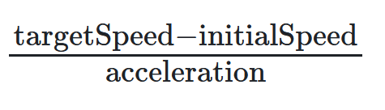

# Embedded: Homework 3

## C Programming Practice Tasks

## Functions

## Onboard Car Function Exercises

In the following tasks, you will write C programs that involve creating and using onboard functions for a car's computer system. These exercises will help you simulate various functionalities that a car's computer might offer to drivers.

**Task 1: Fuel Efficiency Tracker**

Imagine you're designing a car's onboard computer system that helps drivers monitor their fuel efficiency. Write a C program that calculates the car's fuel efficiency in kilometers per liter (km/l). Define a function `calculateKMPL` that takes the distance traveled in kilometers and the amount of fuel used in liters as arguments and returns the fuel efficiency in km/l. The program should then calculate and display the fuel efficiency using this function.

**Task 2: Maintenance Reminder**

As part of the car's onboard computer features, create a C program that assists drivers in keeping track of their car's maintenance schedule. Define functions to input the current mileage, last oil change mileage, and recommended oil change interval in kilometers. The program should inform the driver when it's time for an oil change based on the maintenance schedule.

**Hint**
The function prototype could be this:
`void checkOilChange(int currentMileage, int lastOilChangeMileage, int oilChangeInterval);`

**Task 3: Acceleration Timing**

Write a C program that calculates the time it takes for a car to reach a certain speed. Define functions to input the initial speed, target speed, and acceleration. The program should calculate and display the time it takes to reach the target speed in seconds.

The formula is: 

**Task 4: Smart Trip Planner**

Imagine creating a smart trip planning feature for your car's onboard system. Develop a C program that assists drivers in planning a road trip more efficiently. Define functions to input the destination distance in kilometers, average speed in km/h, and number of planned breaks. Assume that after <ins>every hour of driving, a break is automatically scheduled</ins>. The program should calculate and display the estimated travel time and recommend break times during the trip.

