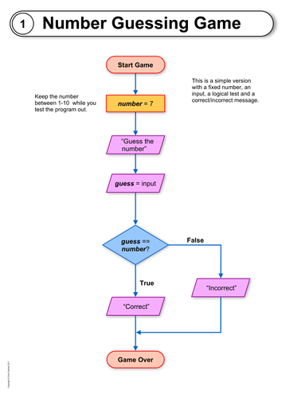

# Embedded: Homework 2

## C Programming Practice Tasks

## Looping and Conditional Statements Exercises

**Task 1: Number Guessing Game**

Write a C program that generates a random number between 1 and 100. Allow the user to guess the number. Provide feedback if the guessed number is higher or lower than the generated number. Use a `do-while` loop to continue the game until the user guesses correctly or decides to quit.

**Hint:** To generate a random number in C, use the `rand()` function from the `stdlib.h` library. Remember to seed the random number generator using `srand()` to ensure different random sequences each time the program runs.

**Task 2: Even-Odd Checker**

Develop a C program that repeatedly takes an integer input from the user. Determine whether the input number is even or odd and display an appropriate message. Use a `while` loop to keep asking for input until the user enters a specific value to exit.

**Hint:** Use the modulo operator (`%`) to check whether a number is even or odd. If a number divided by 2 leaves a remainder of 0, it's even; otherwise, it's odd.

**Task 3: Multiplication Table Break**

Create a C program that generates the multiplication table for a given integer 'n'. However, the table generation should stop at 10 times 'n'. Use a `for` loop to display the multiplication results and incorporate an `if` statement to break the loop when necessary.

**Hint:** You can use a `for` loop to generate the multiplication table. When displaying the results, incorporate an `if` statement to check if the loop index exceeds 10, and if so, use the `break` statement to exit the loop.

**Example Output:** For 'n' = 5, the multiplication table should display:
| Multiplication | Result |
|----------------|--------|
| 5 x 1          | 5      |
| 5 x 2          | 10     |
| 5 x 3          | 15     |
| ...            | ...    |
| 5 x 10         | 50     |

**Task 4: Prime Number Finder**

Write a C program that prompts the user to enter a positive integer 'n'. Determine whether 'n' is a prime number or not. Use a `for` loop to iterate through potential divisors and an `if-else` structure to determine the primality of 'n'. Break the loop when a divisor is found.

**Task 5: Password Validation**

Design a C program that prompts the user to enter a password. The password must meet certain criteria: it should be between 5 and 10 characters and include at least one digit. Allow the user to make three attempts. Use a `do-while` loop and an `if-else` structure to validate the password and count the attempts.

**Hint:** To ensure that the password meets specific criteria, you can check its length using the `strlen()` function from the `string.h` library.
Reference: https://cplusplus.com/reference/cstring/strlen/

**Example Output:** Let's assume the maximum length is 10 characters and the password must contain at least one digit:

- Input: *mySecret123*
- Output: Password is *valid*.