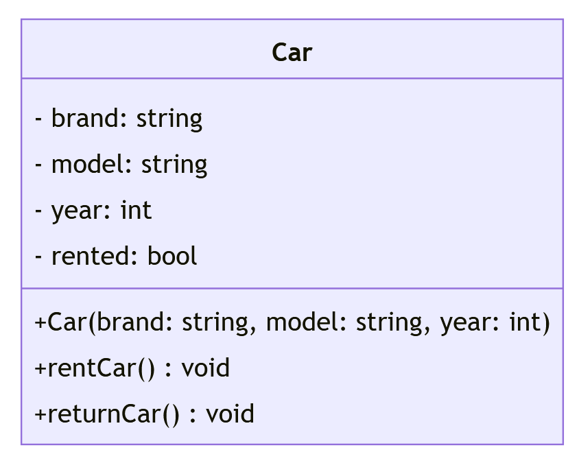

# Embedded: Homework 5

## C++ Programming Practice Tasks

## Object-Oriented Programming (OOP)

## Car Rental System Exercise

In this exercise, we'll explore the concepts of Object-Oriented Programming (OOP) using C++. Keep in mind that OOP is only available in C++, so we'll be using the g++ compiler instead of gcc for compiling.

Imagine we are developing a basic car rental system. We'll start by defining a class named Car to represent individual cars. 

**Basic Exercise:**

The Car class should have the following features:

1. **Private data members:**
   - `brand` (string): Represents the brand of the car.
   - `model` (string): Specifies the model of the car.
   - `year` (int): Denotes the manufacturing year of the car.
   - `rented` (bool): Indicates whether the car is currently rented.

2. **Public member functions:**
   - **Constructor:** Initializes the `brand`, `model`, and `year` of the car. The `rented` status should be set to `false` by default.
   - `rentCar()`: Sets the rented status of the car to `true` if it's available for rent.
   - `returnCar()`: Sets the rented status of the car back to `false`.

Use the following UML class diagram as a template:

In the `main` function of your program:

1. **Introduce the Car Rental System:** Provide an overview of the program's purpose and its simulation of a car rental system.
2. **Create Car Objects:** Generate an array or vector of `Car` objects to represent the available cars in the rental system.

**Hint**: https://en.cppreference.com/w/cpp/container/vector

3. **Interactive Rental Process:** Allow users to select cars for renting or returning based on their availability.

4. **Display Status:** Display the updated status of cars after each rental/return action.

## Car Overview

| Model     | Year | Status      | Rented By       |
|-----------|------|-------------|-----------------|
| 318i      | 2022 | Rented      | Max Mustermann  |
| 520d      | 2021 | Not Rented  | -               |
| X3        | 2023 | Rented      | Maria Müller    |
| 330e      | 2022 | Not Rented  | -               |
| M4        | 2021 | Rented      | Stefan Schmidt  |

