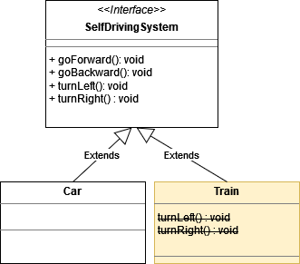
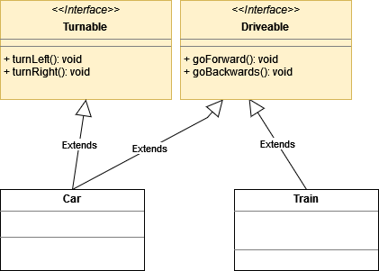

# SW Quality II: Homework 2 - Solution

## Your Tasks
1. Read and understand the following pseudocode: [inheritance_smell.pseudo](./inheritance_smell.pseudo) 
2. What rule is violated when a child class removes _features_ from the base class it inherits from?
3. What principle could you think of to fix the issue and why?
4. Refactor the code ([inheritance_smell.pseudo](./inheritance_smell.pseudo)) accordingly.

LSP (_Liskov Substitution Principle_) is violated when we try to remove features. `NotImplementedException` (or similar) is the biggest violation sign.

You should favor multiple smaller interfaces in face of bigger ones; it is less likely to violate the principle (will talk more in Interface Segregation Principle)

Breaking the LSP principle almost always leads to hard-to-find bugs.

:point_right: Short sidestory here:
> Sometimes is hard to not violate the principle. For example in the .NET framework we can find that 
> the `Array` class implements `IList` interface that has `Add` method. `Array.Add` invocation 
> throws a `NotSupportedException`. Is it a clear violation of the _Liskov Substitution Principle_.

> This problem appeared with .NET 2.0 (when generics were introduced) 
> and since Microsoft didn't want to break the backward compatibility they made this compromise.

# Solution
So what can we do about it? How can the railway developers use our logic as well without violating LSP.
A good approach would be the use ISP (_Interface Segregation Principle_):

Since the problem was with TurnRight or Left, we can split the interface into `Turnable` and `Drivable` interfaces. 
Now, objects can choose what they do and implement only the needed methods.

So why didn't I also break the `ITurnable` interface? I could have defined an `ITurnRight` and `ITurnLeft` interface. 
Having the methods split into two interfaces would have added code complexity with zero benefits. This is how the principle might make your codebase too granular. 

Don't confuse this principle with the _Single Responsibility Principle_. At a first glance, they might seem similar, but they target different problems. The _Single Responsibility Principle_ tries to help you define a class around a single reason for the change. The _Interface Segregation Principle_ is a blueprint for how to define interfaces. 
A class can implement as many interfaces as it wants. The fewer the methods in the interface the better. But don't overdo it. 

Find a full pseudocode sample here: [car_train_with_isp.pseudo](./car_train_with_isp.pseudo)

